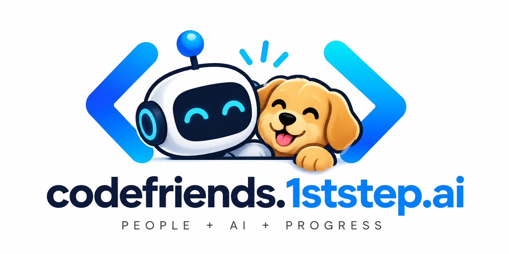

# CodeFriends

<p align="center">
  
</p>

An **AI coding school with your friends in the room** — **Cursor / Claude / Codex / Gemini**.

Presence, 1:1 DMs, invite links, a short profile (GitHub / tools / optional socials), a **school board** (tiny forum), and a **build library** (1stStep starters + **School Paths** + cohort shares + a portable **help packet**) live in a **lightweight popout window / PWA**. The IDE only gets a thin status-bar badge so chat does not burn editor RAM. This is not a Discord-for-devs headline.

> **Not affiliated with Cursor, Anthropic, OpenAI, or Google.** This is an independent community project.

## Architecture

```
IDE (thin)                         Outside the IDE
┌─────────────────────┐            ┌──────────────────────────┐
│ Cursor / VS Code    │  open URL  │ apps/desktop (Tauri 2)   │
│ status bar:         │  or        │ native window + tray     │
│ CodeFriends · N     │  deep link │ wrapping apps/popout     │
└─────────┬───────────┘ ─────────► │ friends + DMs + board + library │
          │ GET /api/presence      └────────────┬─────────────┘
          └──────────────► API (D1 + hub) ◄─────┘
                           Cloudflare Worker  (prod, $0)
                           or apps/server     (local / Node fallback)

Browser / PWA popout remains the fallback if you do not install the desktop app.
```

The daily-driver UX lives in a **dedicated desktop window**. The IDE stays a thin badge. See [docs/DESKTOP-UX-BRIEF.md](./docs/DESKTOP-UX-BRIEF.md).

| Path | Role |
| --- | --- |
| `apps/desktop` | **Tauri 2** native window + tray wrapping `apps/popout`. Not Electron (lighter WebView; see that package README). |
| `apps/popout` | Full dark UI. Static build; production target is **Vercel** (or Cloudflare Pages), or served from `apps/server` |
| `apps/worker` | **$0 production API**: Cloudflare Workers + D1 + Durable Object presence hub |
| `apps/server` | Local Node + `better-sqlite3` (smoke / `npm run dev`). Serves built `apps/popout/dist` when `index.html` is present. Optional Fly/Render + Turso fallback |
| `packages/core` | Shared store, SQL migrations, auth, HTTP + WS handlers |
| `extensions/cursor` | VS Code-compatible status bar + opt-in **Connect CodeFriends?** prompt — **no chat webview** |
| `plugins/claude` | Claude Code plugin: SessionStart prompt + `/codefriends` (`?provider=claude`) |
| `plugins/codex` | Codex plugin: SessionStart prompt + skill (`?provider=codex`) |
| `plugins/gemini` | Gemini CLI extension: SessionStart prompt + `/codefriends` (`?provider=gemini`) |
| `packages/connect-client` | Tiny local companion CLI used by those plugins (also works for generic/Ollama GUIs) |
| `packages/shared` | Shared TypeScript types, protocol, and connect-prompt policy |

**Out of scope:** voice, Live Share, media/blob storage, payments, guaranteed 2000 simultaneous sockets.

## Persistence

User accounts, **linked provider identities**, friend edges, **invite tokens**, profiles, 1:1 DM history, school-board topics, **build-library items**, and **help-packet drafts** live in ordinary SQLite SQL (`users`, `identities`, `sessions`, `friends`, `invites`, `messages`, `topics`, `topic_replies`, `library_items`, `help_packets`). Presence sockets stay in memory (Node) or a Cloudflare Durable Object (production); `last_seen` / status / “now working on” / profile fields are written back to the database.

| Driver | When | Env |
| --- | --- | --- |
| `better-sqlite3` file | Local `npm run dev` / smoke | `CODEFRIENDS_DB` (default `apps/server/data/codefriends.sqlite`, gitignored) |
| **Cloudflare D1** | **$0 production** (`apps/worker`) | `wrangler.toml` `[[d1_databases]]` |
| Turso / libSQL | Optional Node host with ephemeral disks | `CODEFRIENDS_LIBSQL_URL` + `CODEFRIENDS_LIBSQL_AUTH_TOKEN` |

Schema + named migrations live in `packages/core/src/sql.ts` (including `002_dm_thread_cap`, `003_invites`, `004_profile`, `005_school_board`, `006_socials`, `007_builder_profile`, `008_library`, `009_launch_packs`, `010_help_packets`, and `011_drop_launch_packs`). A process / Worker restart keeps users, identities, friends, invites, profiles, DMs, school-board posts, library items, and help-packet drafts. Seed data (`maya` / `parker` / … plus the official 1stStep shelf) is **idempotent** — inserted only when missing, never wiped.

**Invite links:** a signed-in user creates a reusable token (hashed in SQLite, default **7 days**). Share the URL (`?invite=` or `/invite/<token>`) or paste the code. Accepting while signed in (dev username or any live provider) creates a **bidirectional friend edge immediately** — no email, no pending request. The same link can be used by several people until it expires. You cannot accept your own invite. Already-friends is a no-op.

**Status / now working on:** free-text (80 chars) plus optional IDE/client label (`cursor` / `claude` / `codex` / `gemini` / `web`). Sent over the existing `presence` WebSocket message and shown under each friend in the popout.

**Profile share:** optional `githubUrl` (must be `github.com`, pasted — no GitHub OAuth), optional `website`, optional socials (`twitterUrl` / `facebookUrl` / `telegramUrl` / `whatsappUrl`), optional builder signals (`currentlyBuilding`, `ownsBusiness` + `businessNote`, `wantsToHelpOthersBuild`), and a short tools list (comma-separated, stored on `users`). Twitter/X, Telegram, and WhatsApp also accept a handle or phone and normalize to an https URL. You edit your own via `POST /api/me/profile`. Friends see set fields only — chips + links on the DM header, no empty placeholders.

**School board (v0):** Reddit-style but tiny — a topic (`title` + `body` text) and replies, SQLite only. **Any authenticated user on this instance can read and post.** That is the secure default for a self-hosted school cohort sharing one server; there is no public anonymous board. Friends-only visibility is not in v0. No upvotes, images, or live sockets — the popout loads over HTTP. Body is stored as plain text (markdown is accepted and shown as-is).

**Help packet (v0):** on the Library tab, write a portable markdown brief so a friend can finish stuck work **on their own AI usage**, then send back a PR. You create the packet to share; they accept voluntarily. They run agents on their account — this does not stretch vendor quotas. Contents are only the notes you type (no chat-history scrape). Copy or download a `.md` file; drafts stay in `help_packets` for you. Nothing is auto-posted to socials. Template: [docs/help-packet.md](./docs/help-packet.md). Path-specific templates: [docs/help-packets/](./docs/help-packets/).

### School Paths

**Build → Finish → Ship** — eight free, tool-agnostic production outlines (friend-visible demo → restore drill). No certificates, no gated tiers:

- Index: [docs/school-paths/](./docs/school-paths/)
- Path help packets: [docs/help-packets/](./docs/help-packets/) (failure → fix → Ask your AI → prove-it → friend review)
- Optional Path 05 security drills on the official shelf (session regenerate, redirect allowlist, frame denial, session-store ACL)
- Weekly **Ship / Demo Friday** pins: [docs/school-board-prompts.md](./docs/school-board-prompts.md)

**Where to find them in the app:** sign in → **Library** tab → official shelf (author `1ststep`). Cards for **School Paths**, **Path 01** … **Path 08**, **Path help packets**, and optional **Security:** drills open the GitHub markdown. Same idempotent seed path as the other 1stStep shelf entries (`packages/core/src/seed.ts`).

**DM history cap:** each 1:1 thread keeps the last **200** messages (`CODEFRIENDS_DM_HISTORY_LIMIT`). Older rows are pruned on write. Text only — no media, no blob store.

Sessions are random 32-byte bearer tokens; only a SHA-256 hash is stored. There are **no passwords**. One-time **handoff** codes (also hashed, ~2 minutes) let the Cursor extension open the popout already signed in.

## Auth: provider-native identity

Production login is **Continue with Google** (Google OIDC). Provider id in the API stays `gemini`. Cursor / Claude / Codex still have no public third-party identity API, so the popout does not pretend those buttons work.

The same human can appear **once** in the friends graph after linking a second provider onto one CodeFriends user id.

```
identities (provider, subject)  ──►  users.id
     gemini  /  cursor  /  claude  /  codex  /  dev
```

- **Login** with Google finds that identity row, or creates a user.
- **Link** (already signed in, then complete another provider) attaches a second `(provider, subject)` to the same user.
- Identities are never auto-merged by email. Linking is explicit.
- GitHub is **not** a login provider. If it appears later, it would only be optional linking.

### Provider status (honest)

| Provider | Product account | Status | What is actually possible |
| --- | --- | --- | --- |
| **Google** | Google account (API id `gemini`) | **Implemented** (Sign in with Google / OIDC + PKCE) | Public, registerable OAuth Web client. Popout **Continue with Google** is `live` once env vars are set; otherwise `unconfigured`. This is how real users get in. |
| **Cursor** | Cursor account | **Blocked** | No public “Sign in with Cursor” identity API. Cursor’s OAuth support is MCP-outbound (the IDE talking to *your* server), not Cursor account identity for a third-party app. |
| **Claude** | Claude.ai / Anthropic | **Blocked** | No public third-party identity OAuth. Consumer OAuth tokens are reserved for Claude.ai / Claude Code; using them in other products violates Anthropic’s terms. |
| **Codex** | ChatGPT / Codex | **Blocked** | “Sign in with ChatGPT” is a real identity product but **partner-only** (no self-serve app registration). Codex CLI OAuth is first-party — do not impersonate that client. |
| **Dev username** | local demo | **Dev only** | `POST /api/auth/login { "username": "maya" }` — no password. On when `NODE_ENV` is not `production`, or `CODEFRIENDS_DEV_LOGIN=1`. Hidden in the popout unless availability is `dev`. |

Each blocked provider still has a **typed adapter** (`start` / `complete` when an official program exists). `GET /api/auth/providers` returns the same catalog the popout renders — including `blockedReason` and `nextStep`. Blocked buttons are collapsed under **Coming later**.

`CODEFRIENDS_MOCK_PROVIDERS=1` enables `POST /api/auth/:provider/mock { "subject": "…" }` so smoke tests and architecture demos can exercise linking **without pretending the official login works**.

### Production login: Google Cloud (OIDC)

Gemini consumer identity **is** a Google account. Create one **Web application** OAuth client and set the env vars below. Do not commit the client secret.

1. Open [Google Cloud Console](https://console.cloud.google.com/) → select or create a project.
2. **APIs & Services → OAuth consent screen**
   - User type: **External**
   - App name: `CodeFriends`
   - User support email + developer contact: your address
   - Scopes: the adapter requests `openid`, `email`, and `profile` (non-sensitive)
   - If the consent screen stays in **Testing**, add every real user as a test user. Publishing the app is what lets arbitrary Google accounts sign in.
3. **APIs & Services → Credentials → Create credentials → OAuth client ID**
   - Application type: **Web application**
   - Name: `CodeFriends web`
4. **Authorized JavaScript origins** (exact, no path, no trailing slash):
   - `http://127.0.0.1:5173` (Vite popout)
   - `http://localhost:5173`
   - `http://127.0.0.1:8787` (Node serving the popout)
   - `http://localhost:8787`
   - `https://codefriends.1ststep.ai`
5. **Authorized redirect URIs** (must match `GEMINI_GOOGLE_CALLBACK_URL` character-for-character):
   - `http://127.0.0.1:8787/api/auth/gemini/callback`
   - `http://localhost:8787/api/auth/gemini/callback` (Windows often uses `localhost`; Google treats it as different from `127.0.0.1`)
   - `https://codefriends.1ststep.ai/api/auth/gemini/callback`
6. Copy the client ID and client secret into env (never git).

| Variable | Purpose |
| --- | --- |
| `GEMINI_GOOGLE_CLIENT_ID` | OAuth client id from the console |
| `GEMINI_GOOGLE_CLIENT_SECRET` | OAuth client secret from the console |
| `GEMINI_GOOGLE_CALLBACK_URL` | Must be one of the redirect URIs above. If omitted, defaults to `{CODEFRIENDS_PUBLIC_URL}/api/auth/gemini/callback` |
| `CODEFRIENDS_PUBLIC_URL` | Public API origin. Production: `https://codefriends.1ststep.ai` |
| `CODEFRIENDS_POPOUT_URL` | http(s) origin the OAuth **callback** sends the browser to (`?handoff=`). Production: `https://codefriends.1ststep.ai`. Must not be `codefriends://…` — that scheme is only for the IDE badge. |

On a Windows self-host, popout and API share that HTTPS origin. Split Worker + Vercel: `CODEFRIENDS_PUBLIC_URL` / callback URI are the Worker origin; `CODEFRIENDS_POPOUT_URL` is the Vercel origin. See [docs/self-host-windows.md](./docs/self-host-windows.md) for the PC + tunnel path.

Copy [`.env.example`](./.env.example) to `.env`. **Do not commit secrets.**

### Dev username path (local demo / smoke)

No OAuth app required. First login creates the user. Seed roster (unless `CODEFRIENDS_SEED=0`):

`maya` · `devjay` · `sam` · `rio` · `alex` · `casey` · `taylor` · `jordan` · `parker`

They are already friends. Seed DMs exist between `maya` and `parker`.

In production (`NODE_ENV=production`) this path is **off** unless you explicitly set `CODEFRIENDS_DEV_LOGIN=1`.

## Local run

Needs Node 20+ (Node 22 used in CI-ish environments).

```bash
cp .env.example .env   # optional; defaults work for the username demo
npm install
npm run dev
```

- API + WebSocket: <http://127.0.0.1:8787>
- Popout UI: <http://127.0.0.1:5173> (proxies `/api` and `/ws` to the server)
- SQLite file: `apps/server/data/codefriends.sqlite`
- Admin monitor: <http://127.0.0.1:8787/admin> — set `CODEFRIENDS_ADMIN_TOKEN` in `.env` first (see below)

### Admin monitor

Private health page for whoever runs `apps/server`. It is **not** in the popout.

1. Put a long random secret in `.env` as `CODEFRIENDS_ADMIN_TOKEN`. Unset → `/admin` and `/metrics` are 404.
2. Open <http://127.0.0.1:8787/admin> (or `/admin/monitor`) and paste the token, or `curl -H 'Authorization: Bearer …' http://127.0.0.1:8787/metrics`.
3. Same-origin cookie is `HttpOnly` / `SameSite=Strict`. A normal CodeFriends login session cannot open this page.

Windows self-host notes: [docs/self-host-windows.md](docs/self-host-windows.md). Spec + field meanings: [docs/monitoring-dashboard.md](docs/monitoring-dashboard.md).

### Desktop app (native window + tray)

Needs the same `npm run dev` stack (the WebView loads the Vite popout). **Rust 1.88+** (1.98 used here) plus WebKitGTK (Linux) / WebView2 (Windows) / WKWebView (macOS) for the shell. `rustup default stable` is enough if your toolchain is older than 1.88.

```bash
# terminal 1
npm run dev

# terminal 2
npm run desktop
```

Or one shot:

```bash
npm run dev:desktop
```

That opens a CodeFriends window (not a browser tab) and a tray / menu-bar icon: **Open**, **Available**, **Away**, **Quit**. Closing the window hides to the tray.

Deep link stub: `codefriends://open?dm=…` / `?handoff=…` (Linux `tauri dev` registers the scheme at runtime; installed packages register it on Windows/Linux; macOS needs an installed `.app`). Point the IDE badge at `codefriends://open` to hand off here instead of Chrome. Details: [apps/desktop/README.md](./apps/desktop/README.md).

`npm run desktop:build` packages a `.deb` (Linux) after building `apps/popout/dist`. macOS `.dmg` and Windows NSIS need a smoke on those machines.

Open the popout in two browser profiles (or a window + a private window), or the desktop app plus a private browser window. Sign in as `maya` in one and `parker` in the other. Click a friend to DM. Presence and messages are live. Restart the server: the same users and DMs are still there.

To add someone who is not already on the seed roster: **Create invite link** in the popout, copy it, and open it while signed in as the other person (or paste the code). Accepting makes you friends immediately. Set **Now working on** — friends see that status text under your name.

To fill **Agents online** the way the concept mockup does (without a second human), keep the seed agent sockets alive:

```bash
npm run demo:agents
```

To install as a PWA, open the popout in Chrome / Edge and use **Install app** / **Add to dock**.

### Spare Windows PC (Node + Cloudflare Tunnel, $0)

To run `apps/server` on a spare Windows box — SQLite on disk, built popout served from the API port, Cloudflare quick tunnel or named `codefriends.1ststep.ai` — see **[Self-host on Windows](docs/self-host-windows.md)**. Helper scripts live in `scripts/windows/`. That path does not need Vercel or the Worker; keep `www` / `app` on Vercel and Google MX if you already have them.

### Cursor / VS Code extension (opt-in, not Cursor’s login screen)

```bash
npm run compile -w codefriends
```

Then in Cursor, VS Code, or VSCodium: **Extensions → Install from Location…** and pick `extensions/cursor`.

This is an **extension** prompt. We cannot inject into Cursor’s native account login screen, and we do not claim Cursor SSO.

On activate (when there is no stored CodeFriends session), the extension shows **Connect CodeFriends?** with:

| Action | What happens |
| --- | --- |
| **Connect** | Opens/focuses the popout (`?provider=cursor` in Cursor, or `?provider=generic` in VSCodium / vanilla VS Code) and session handoff if this editor already has a token |
| **Not now** | Writes a 3-day snooze to extension `globalState`; asks again later |
| **Don’t ask again** | Persists in `globalState`; never auto-prompts |

If SecretStorage already has a CodeFriends token, the prompt is skipped. The status bar stays `CodeFriends · N online` (a quiet `$(check)` when connected). Click it, or run **CodeFriends: Open popout**.

| Setting / command | Default / notes |
| --- | --- |
| `codefriends.popoutUrl` | `http://127.0.0.1:5173` |
| `codefriends.serverUrl` | `http://127.0.0.1:8787` |
| `codefriends.pollMs` | `15000` |
| `codefriends.provider` | `auto` — Cursor app → `cursor`, otherwise `generic` |
| `codefriends.connectPrompt` | `true` — set `false` to suppress the startup prompt |
| **CodeFriends: Sign in with username (dev)** | Stores a token in SecretStorage; used only for the local demo |
| **CodeFriends: Sign out of this editor** | Clears that token |

The extension **does not** embed friends/chat in a webview.

### Other hosts (same popout, thin plugins)

Same UX idea: when someone is already in that app, ask if they also want CodeFriends. Social features stay in the popout + server.

| Host | Install | Opens popout with | Identity it can actually do | What it cannot do |
| --- | --- | --- | --- | --- |
| **Cursor** | `extensions/cursor` | `?provider=cursor` | Extension opt-in + optional stored session handoff | Cursor account SSO |
| **VS Code / VSCodium / Continue-style** | same `extensions/cursor` (`provider=generic`) | `?provider=generic` | CodeFriends identity (dev username / Gemini Google) | “Login with VS Code” |
| **Claude Code** | `plugins/claude` (`claude plugin marketplace add` this repo, or `--plugin-dir plugins/claude`) | `?provider=claude` | SessionStart notice + `/codefriends` / `/codefriends-not-now` / `/codefriends-never` | Claude.ai / Claude Code OAuth |
| **Codex** | `plugins/codex` (repo marketplace `.agents/plugins/marketplace.json`) | `?provider=codex` | SessionStart notice + `codefriends` skill | Sign in with ChatGPT (partner-only) |
| **Gemini CLI** | `gemini extensions install ./plugins/gemini` | `?provider=gemini` | SessionStart notice + `/codefriends`; **Sign in with Google** in the popout when `GEMINI_GOOGLE_*` is set | Replacing Gemini CLI’s own login |
| **Ollama / Open WebUI / SillyTavern / any GUI** | Browser popout, or the VS Code extension, or `node packages/connect-client/connect.mjs --provider generic --prompt` | `?provider=generic` (alias of local CodeFriends identity, not `dev` SSO) | Opt-in CodeFriends username / Google | **No** “login with Ollama.” Ollama has no account SSO |

CLI plugins persist **Not now** / **Don’t ask again** per host in `~/.codefriends/connect-state.json`. A stored `sessionToken` there (or SecretStorage in the VS Code extension) skips the nag.

```bash
# Generic companion (also what the host plugins run)
node packages/connect-client/connect.mjs --provider generic --prompt
node packages/connect-client/connect.mjs --provider claude --action connect
```

Prompt-path checks (first run, dismiss, don’t ask again, already connected):

```bash
npm run test:connect
```

## Smoke test

Proves two users can go online, exchange a 1:1 DM, **and that history is still there after a server restart**. Also exercises mock provider linking, **invite accept** (reusable token → friend edge), **status-text broadcast**, **profile share** (including socials), **school board**, **build library** (official shelf + community add), **help packet** (create + fetch, required sections), serving the built popout, **admin `/metrics` gated**, and **Google OAuth start/callback/handoff**. Starts an ephemeral server with a temp SQLite file.

```bash
npm run smoke
npm run test:connect
```

Expected: `smoke ok: maya + parker online, 1:1 DM delivered, history survived restart, identities linked, DM cap pruned, invite accepted, status broadcast, profile shared, socials cleared, school board topic+reply, build library official+community, help packet create+fetch, popout static served, admin metrics gated, google oauth start/callback/handoff`

`test:connect` prints the documented prompt paths (first run, Not now cooldown, Don’t ask again, already connected, host popout URLs).

## HTTP + WebSocket

| Method | Path | Notes |
| --- | --- | --- |
| `GET` | `/` (and other non-API paths) | Built popout from `apps/popout/dist` when `index.html` exists; otherwise JSON 404 |
| `GET` | `/health` | Liveness + online count + `store` (`sqlite` / `libsql` / `d1`) + `dmHistoryLimit` |
| `GET` | `/metrics` | Admin JSON. 404 unless `CODEFRIENDS_ADMIN_TOKEN` matches Bearer / `X-Admin-Token` / cookie. Node server only |
| `GET` | `/admin` | Admin dashboard (login form if no cookie). Alias: `/admin/monitor`. Node server only |
| `GET` | `/api/auth/providers` | Catalog: live / unconfigured / blocked / dev / mock |
| `POST` | `/api/auth/login` | Dev only. `{ username, displayName?, client? }` → `{ token, user }` |
| `GET` | `/api/auth/gemini/start` | Google OIDC (needs env). User-visible name is **Continue with Google**. `?link=1&token=` to attach to the current user |
| `GET` | `/api/auth/gemini/callback` | Exchanges the code, then redirects to the popout with `?handoff=` |
| `GET` | `/api/auth/:provider/start` | Cursor / Claude / Codex return **501** with the blocked reason |
| `POST` | `/api/auth/:provider/mock` | Only if `CODEFRIENDS_MOCK_PROVIDERS=1`. `{ subject }` |
| `POST` | `/api/auth/handoff` | Bearer → one-time popout code |
| `POST` | `/api/auth/handoff/redeem` | `{ code }` → `{ token, user }` |
| `POST` | `/api/auth/logout` | Revokes that bearer token |
| `GET` | `/api/me` | User + friends + linked identities |
| `POST` | `/api/me/profile` | Bearer + `{ githubUrl?, website?, tools?, twitterUrl?, facebookUrl?, telegramUrl?, whatsappUrl?, currentlyBuilding?, ownsBusiness?, businessNote?, wantsToHelpOthersBuild? }` — own profile only |
| `GET` / `POST` | `/api/friends` | List / add by username |
| `POST` | `/api/invites` | Bearer → `{ token, url, path, expiresAt }` (reusable, 7 days) |
| `GET` | `/api/invites/:token` | Public peek: inviter + expiry (no auth) |
| `POST` | `/api/invites/accept` | Bearer + `{ token }` (raw code or pasted URL) → friend edge |
| `GET` | `/api/messages?with=` | History |
| `GET` | `/api/topics` | Bearer — recent school-board topics (instance-wide for signed-in users) |
| `POST` | `/api/topics` | Bearer + `{ title, body }` |
| `GET` | `/api/topics/:id` | Bearer — topic + replies |
| `POST` | `/api/topics/:id/replies` | Bearer + `{ body }` |
| `GET` | `/api/library` | Bearer — official 1stStep shelf first, then recent community items |
| `POST` | `/api/library` | Bearer + `{ title, description, url, kind }` — community item, https URLs only |
| `DELETE` | `/api/library/:id` | Bearer — own community item only |
| `GET` | `/api/help-packets` | Bearer — your help-packet drafts |
| `POST` | `/api/help-packets` | Bearer + `{ title, goal, repoUrl?, branch?, paths?, constraints?, blocked?, successCriteria?, sendBack?, libraryItemUrl? }` — generates markdown, saves a draft |
| `GET` | `/api/help-packets/:id` | Bearer — own draft only |
| `GET` | `/api/presence` | Public online count (status bar) |
| `WS` | `/ws?token=` | `hello`, `presence` (includes `statusText` + `client`), `add_friend`, `dm`, `typing` |

## $0 deploy (not already live)

Nothing in this repo is pre-hosted. You click through **Vercel** (popout) and **Cloudflare** (API + D1 + WebSockets). No new paid plan is required if you already have a free/Hobby Vercel account; Cloudflare’s free Workers + D1 + Durable Objects tier does not need a second subscription.

**Product shape that keeps it free:** text presence + 1:1 DMs + school-board text + library links. No images, voice, or object storage.

**Honest scale:** designed for about **1–2000 registered users** with light concurrent presence. That is **not** a guarantee of 2000 simultaneous sockets. Free-tier request and duration limits will shed load before that.

### What you click

| Where | What to create | Why |
| --- | --- | --- |
| [Cloudflare Dashboard](https://dash.cloudflare.com) → Workers & Pages | A free Workers account (if you do not have one) | Hosts the API + WebSockets |
| Cloudflare → Workers & Pages → D1 | Database named `codefriends` | Durable users / friends / DMs |
| This repo → `apps/worker/wrangler.toml` | Paste the D1 `database_id` | Worker binding |
| Cloudflare → Workers → `codefriends-api` → Settings → Variables | Secrets / vars listed below | Auth + CORS + popout redirect |
| [Vercel](https://vercel.com) → Add New Project | Import this Git repo, **Root Directory = repo root** | Builds `apps/popout` via `vercel.json` |
| Vercel → Project → Settings → Environment Variables | `VITE_CODEFRIENDS_API_URL`, `VITE_CODEFRIENDS_WS_URL` | Baked into the static SPA at **build** time |
| Google Cloud Console | Web OAuth client | **Required for real users.** Continue with Google is the production login |

Chicken-and-egg: deploy the Worker first (you get `*.workers.dev`), then deploy the popout with that URL, then set `CODEFRIENDS_POPOUT_URL` on the Worker and redeploy it. Changing Vite env vars later requires a **Vercel Redeploy**.

### 1. Cloudflare API (preferred backend)

From a machine with Node 20+ and a Cloudflare login:

```bash
cd apps/worker
npx wrangler login
npx wrangler d1 create codefriends
```

Copy the printed `database_id` into `apps/worker/wrangler.toml` (replace the all-zero placeholder). Commit that id — it is not a secret.

```bash
# optional local check (uses local D1; copy .dev.vars.example → .dev.vars)
npx wrangler dev

npx wrangler deploy
```

Dashboard clicks after deploy:

1. Workers & Pages → **codefriends-api** → Settings → **Domains** — copy `https://codefriends-api.<subdomain>.workers.dev`.
2. Settings → **Variables and Secrets**:

| Name | Production value | Secret? |
| --- | --- | --- |
| `CODEFRIENDS_PUBLIC_URL` | `https://codefriends-api.<subdomain>.workers.dev` | no |
| `CODEFRIENDS_POPOUT_URL` | `https://<your-app>.vercel.app` (set after step 2) | no |
| `CODEFRIENDS_DEV_LOGIN` | `0` for a public app; `1` only if you accept passwordless usernames on the internet | no |
| `CODEFRIENDS_SEED` | `1` to keep the demo roster; `0` for an empty friends graph | no |
| `CODEFRIENDS_MOCK_PROVIDERS` | `0` | no |
| `CODEFRIENDS_DM_HISTORY_LIMIT` | `200` | no |
| `GEMINI_GOOGLE_CLIENT_ID` / `SECRET` / `CALLBACK_URL` | production login; callback = `{CODEFRIENDS_PUBLIC_URL}/api/auth/gemini/callback` | secret for the client secret |

`GET https://codefriends-api.<subdomain>.workers.dev/health` should return `{ "ok": true, "store": "d1", ... }`. That endpoint is **not** provisioned for you until you deploy.

### 2. Vercel popout (static SPA)

1. Vercel → **Add New** → Import the GitHub repo.
2. Leave **Root Directory** as the repository root (`vercel.json` already points at `apps/popout/dist`).
3. Framework Preset: **Other**.
4. Settings → Environment Variables (Production):

| Name | Value |
| --- | --- |
| `VITE_CODEFRIENDS_API_URL` | `https://codefriends-api.<subdomain>.workers.dev` |
| `VITE_CODEFRIENDS_WS_URL` | `wss://codefriends-api.<subdomain>.workers.dev/ws` |

5. Deploy. Open the `.vercel.app` URL — you should see the login screen. Sign-in will fail until the Worker URL is reachable and CORS/`CODEFRIENDS_POPOUT_URL` match that origin.
6. Back on Cloudflare, set `CODEFRIENDS_POPOUT_URL` to the Vercel origin and **Deploy** the Worker again.

Alternative: **Cloudflare Pages** on `apps/popout/dist` with the same Vite env vars. `apps/popout/public/_redirects` is the SPA fallback.

### 3. Google OAuth (production login, still $0)

Follow **[Production login: Google Cloud (OIDC)](#production-login-google-cloud-oidc)** above. For a Worker + Vercel split, add the Worker callback as well:

- Authorized JavaScript origins: the Vercel origin and `https://codefriends.1ststep.ai` if you use that hostname.
- Authorized redirect URI: `https://codefriends-api.<subdomain>.workers.dev/api/auth/gemini/callback` **or** `https://codefriends.1ststep.ai/api/auth/gemini/callback` when the Node server serves both API and popout. Must match `GEMINI_GOOGLE_CALLBACK_URL` exactly.

### 4. After it is up

Point the Cursor/VS Code settings (or `CODEFRIENDS_POPOUT_URL` / `CODEFRIENDS_SERVER_URL` for connect plugins) at the public URLs:

| Setting | Example |
| --- | --- |
| `codefriends.popoutUrl` | `https://<your-app>.vercel.app` |
| `codefriends.serverUrl` | `https://codefriends-api.<subdomain>.workers.dev` |

### Free-tier limits (will move; check the vendor pages)

| Vendor | Typical free cap that matters here | What happens when you exceed it |
| --- | --- | --- |
| **Vercel Hobby** | Static hosting + bandwidth cap | Popout 4xx / paused project — upgrade or wait |
| **Workers requests** | ~100k / day on the free plan | API/WS calls start failing until reset |
| **Durable Objects** | Free-plan request + duration budget (hibernating sockets are cheaper than a hot isolate) | Presence drops; clients reconnect |
| **D1** | ~5M reads / 100k writes / day, ~5 GB | Writes fail; prune + text-only DMs keep this small |
| **Turso Starter** (fallback only) | Free row / storage quota | Node fallback cannot persist |

This is **not** a SLA. A busy evening of reconnect storms can burn the Workers daily budget.

### Spare Windows PC (still $0, you keep the machine awake)

Documented separately: **[docs/self-host-windows.md](docs/self-host-windows.md)**. Node + SQLite on a PC you already own, Cloudflare Tunnel for HTTPS. No inbound ports. Quick-tunnel URLs **rotate** every restart; a named tunnel is how you get a stable `codefriends.1ststep.ai`.

### Node fallback on Fly / Render (still $0, worse realtime)

Use only if you already have Fly or Render free allowance. Both often **ask for a credit card** even at $0, machines **sleep**, and a local SQLite file **dies** on recycle.

1. Create a free [Turso](https://turso.tech) database (libSQL). Set `CODEFRIENDS_LIBSQL_URL` + `CODEFRIENDS_LIBSQL_AUTH_TOKEN`.
2. `apps/server/Dockerfile` + root `fly.toml` / `render.yaml` — replace placeholder app names; do not assume they exist.
3. Set `HOST=0.0.0.0`, `CODEFRIENDS_PUBLIC_URL`, `CODEFRIENDS_POPOUT_URL`, `NODE_ENV=production`.
4. Expect WebSockets to drop when the instance sleeps. Prefer `apps/worker`.

### What you do **not** need

- A paid always-on Node VM
- Checking `.env` or OAuth secrets into git
- Blob / media storage
- Postgres (ordinary SQL; D1 / libSQL / SQLite share the same schema)

## Next

- Desktop visual refresh (rail + thread, invite card, native DM notifications) — shell is in `apps/desktop`; see the UX brief
- Prompt / knowledge base and learning paths (education-first next slice)
- Friends-only school-board toggle (v0 is instance-wide for signed-in users)
- Official Cursor / Claude / Codex identity programs → fill in the existing adapters
- Group chats, file uploads, voice / video (not this slice)

## License

MIT. See [LICENSE](./LICENSE).
